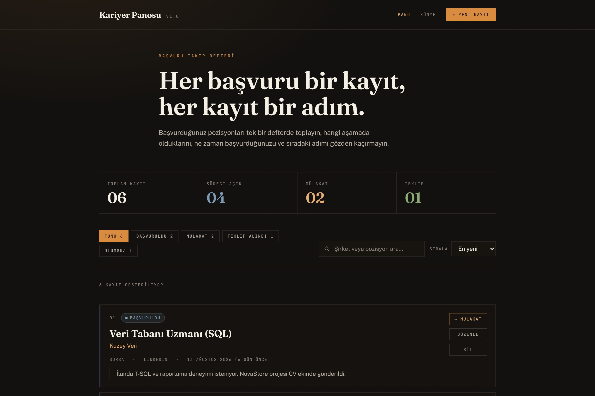
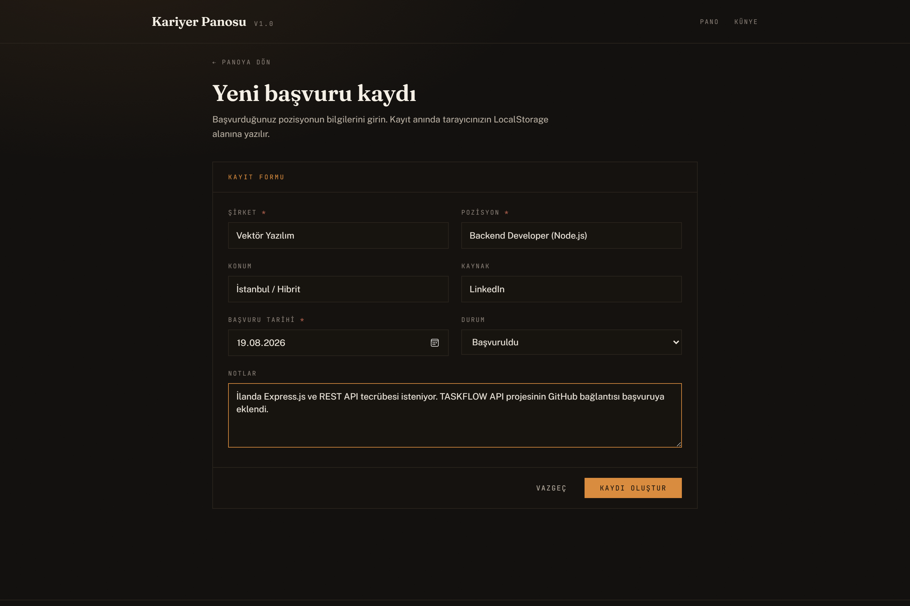
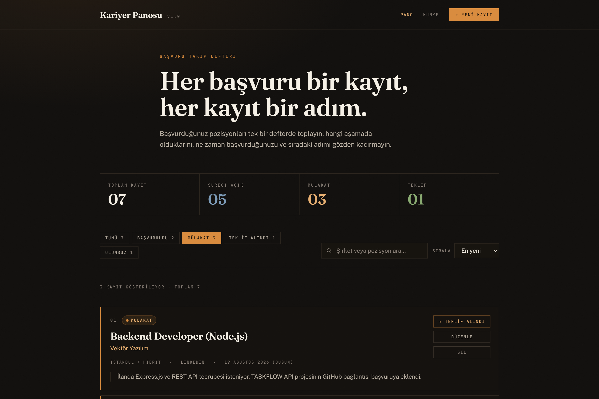
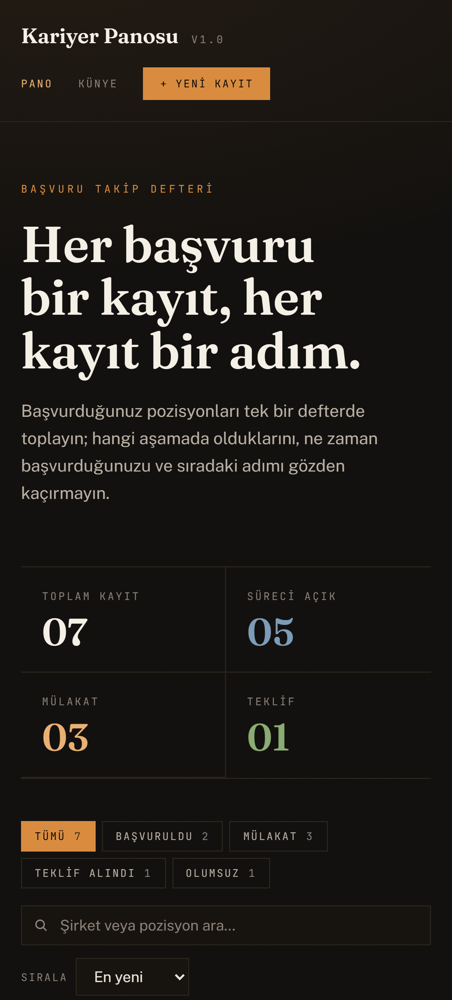

# Kariyer Panosu

> Web Geliştirme; JavaScript — Bitirme Projesi
> **Hazırlayan:** Süleyman Hamurcu

**Kariyer Panosu**, iş başvurularını tek bir defterde takip etmeyi sağlayan bir tek
sayfa uygulamasıdır (SPA). Başvurduğunuz pozisyonu kaydeder, hangi aşamada olduğunu
gösterir ve süreç ilerledikçe durumunu güncellemenize izin verir.

**Canlı demo:** _(Netlify bağlantısı teslim formunda paylaşılmıştır)_

## Ekran görüntüleri


*Pano — istatistik şeridi, durum filtreleri, arama ve kayıt listesi*


*Yeni başvuru kaydı formu (Ekleme)*


*Kayıt eklendikten sonra durumu "Mülakat" aşamasına ilerletildi ve aynı duruma göre filtrelendi (Güncelleme + Listeleme)*


*Silme işlemi onay penceresi (Silme)*



*Mobil genişlikteki duyarlı görünüm*

## Yönergedeki dört işlem

| İşlem | Uygulamadaki karşılığı |
|---|---|
| **Ekle** | Kayıt formu ile yeni başvuru oluşturma (`/basvuru/yeni`) |
| **Listele** | Panoda kartlar hâlinde listeleme + duruma göre filtre, arama ve sıralama |
| **Güncelle** | Kart üzerinden tek tıkla durum ilerletme veya form ile tüm alanları düzenleme |
| **Sil** | Onay penceresi sonrası kaydı kalıcı olarak kaldırma |

Veriler tarayıcının **LocalStorage** alanında (`kariyer-panosu:applications` anahtarı)
saklanır; sunucu gerektirmez.

## Kullanılan teknolojiler

| Bileşen | Sürüm |
|---|---|
| React | 19 |
| Vite | 8 |
| TypeScript | 5 |
| Tailwind CSS | 4 |
| React Router | 7 |

## Kurulum ve çalıştırma

```bash
# 1) Projeyi indirin
git clone https://github.com/slmn-hmrc/kariyer-panosu.git
cd kariyer-panosu

# 2) Bağımlılıkları kurun
npm install

# 3) Geliştirme sunucusunu başlatın
npm run dev          # http://localhost:5173

# 4) Üretim derlemesi ve önizleme
npm run build
npm run preview      # http://localhost:4173
```

## Proje yapısı

Yönergede istenen `components`, `pages` ve `interfaces` klasörleri birebir kullanılmıştır:

```
src/
├── components/        # ApplicationCard, ApplicationForm, FilterBar, StatsPanel,
│                      # StatusBadge, ConfirmDialog, EmptyState
├── pages/             # DashboardPage, ApplicationFormPage, AboutPage
├── interfaces/        # Application.ts, Status.ts  (TypeScript tip tanımları)
├── hooks/             # useLocalStorage.ts, useApplications.tsx (CRUD tek kaynak)
├── lib/               # seed.ts (örnek kayıtlar), format.ts (tarih yardımcıları)
├── App.tsx            # Kabuk + React Router yönlendirmeleri
└── index.css          # Tailwind teması ve tasarım dili
```

## Tasarım notu

Arayüz, standart yönetim paneli görünümünden uzaklaşıp bir **arşiv defteri** dilini
benimser: sıcak mürekkep siyahı zemin, kemik beyazı tipografi ve oker aksan.
Başlıklarda `Fraunces`, gövde metninde `Public Sans`, metaveri etiketlerinde
`JetBrains Mono` kullanılmıştır. Tasarım mobil genişlikten masaüstüne kadar
duyarlıdır (responsive).

## Sayfalar

| Rota | İçerik |
|---|---|
| `/` | Pano — istatistik şeridi, filtreler, kayıt listesi |
| `/basvuru/yeni` | Yeni başvuru kayıt formu |
| `/basvuru/:id` | Mevcut kaydı düzenleme |
| `/hakkinda` | Proje künyesi ve teknoloji listesi |

Netlify'da tek sayfa uygulamasının derin bağlantılarının çalışması için
`public/_redirects` dosyası kullanılmıştır.
